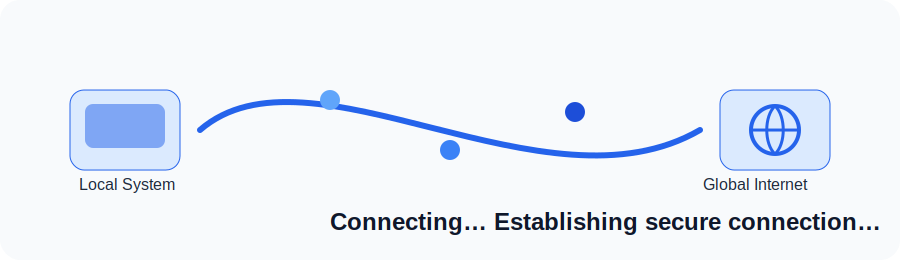

# S3Drive

A polished Next.js interface for securely connecting to AWS S3 and managing files from the browser.

## Project Overview
S3Drive lets users input AWS credentials locally in-browser, validate bucket access, and work with their S3 workspace using a cleaner dashboard interface.

### New in this update: Connection Loader
A reusable `ConnectionLoader` now appears after users submit credentials to visually communicate secure session establishment:
- **Left node:** Local system/device
- **Right node:** Global internet
- Animated connection path with moving data particles
- Pulsing/glow effects for active nodes
- Status text updates: **“Connecting…”** and **“Establishing secure connection…”**
- Accessibility support (`role="status"`, `aria-live`, reduced-motion handling)

## Demo


## Tech Stack
- **Framework:** Next.js (App Router), React
- **Styling:** Tailwind CSS
- **Animation:** Framer Motion + inline SVG
- **Testing:** Vitest + React Testing Library
- **CI/CD:** GitHub Actions
- **Deployment:** Vercel

## Repository Structure
```text
app/                  # Next.js app routes
src/
  components/         # Reusable UI modules
  hooks/              # Shared hooks
  utils/              # Utility helpers
public/
tests/                # Component tests
docs/                 # Architecture and project docs
.github/              # Issue templates, PR template, workflows
```

## Installation
```bash
git clone https://github.com/knightabir/S3Drive.git
cd S3Drive
npm install
npm run dev
```

Open `http://localhost:3000`.

## Build
```bash
npm run build
```

## Testing
```bash
npm run test
```

## Lint & Formatting
```bash
npm run lint
npm run format
```

## Deployment (Vercel)
1. Push your branch to GitHub.
2. Import the repo in Vercel.
3. Confirm settings:
   - Framework preset: **Next.js**
   - Install command: `npm install`
   - Build command: `npm run build`
4. Add environment variables from `.env.example` as needed.
5. Deploy.

Optional `vercel.json` is included for explicit command configuration.

## Contributing
Please read [CONTRIBUTING.md](CONTRIBUTING.md), [CODE_OF_CONDUCT.md](CODE_OF_CONDUCT.md), and [SECURITY.md](SECURITY.md) before opening PRs.

## License
Distributed under the MIT License. See [LICENSE](LICENSE).
